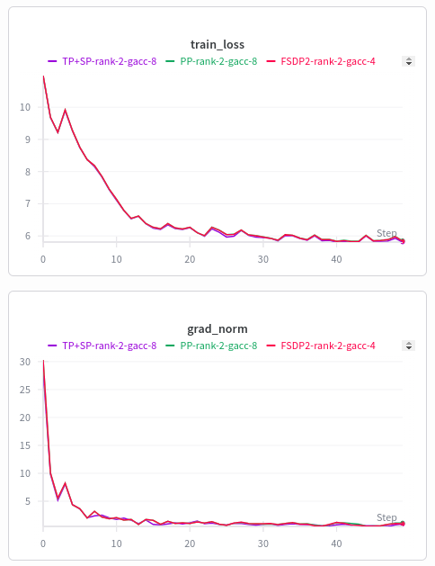

# nanoGPT-distributed

This repository provides implementations of distributed training techniques for the GPT-2 (nano version) model using PyTorch. 
It includes scripts for training nanoGPT with 
- Fully Sharded Data Parallel2 (FSDP2)
- Pipeline Parallelism (PP)
- Tensor Parallelism + Sequence Parallelism (TP+SP).

For demonstration purposes, the model is trained on the Tiny Shakespeare dataset using 2 T4 GPUs provided by Kaggle. Additional details on the training configurations are provided below:

- Fully Sharded Data Parallel (FSDP2):
    - Total Batch Size: 32,768 tokens
    - Gradient Accumulation Steps: 4 (batch size per step:4096 tokens, 2 batches per step)
- Pipeline Parallelism (PP):
    - Total Batch Size: 32,768 tokens
    - Gradient Accumulation Steps: 8 (batch size per step:4096 tokens, 1 batch per step)
    - Number of microbatches: 4
- Tensor Parallelism + Sequence Parallelism (TP+SP):
    - Total Batch Size: 32,768 tokens
    - Gradient Accumulation Steps: 8 (batch size per step:4096 tokens, 1 batch per step)

## Tested Environments
- Python 3.11.13
- PyTorch 2.6.0
- CUDA 12.4
- NVIDIA 2 T4 GPUs (16GB VRAM each, provided by Kaggle)

## Usage

To run the training scripts, use the following commands:
- For FSDP:
```bash
torchrun --nproc_per_node=2 fsdp_train.py
```
- For Pipeline Parallelism:
```bash
torchrun --nproc_per_node=2 pp_train.py
```
- For Tensor Parallelism + Sequence Parallelism:
```bash
torchrun --nproc_per_node=2 tp_train.py
```

Change the `--nproc_per_node` flag based on the number of GPUs available on your machine.

## Results

The training scripts log the training loss and gradient norms to Weights & Biases (wandb) for monitoring. The logs from my training runs can be found [here](https://wandb.ai/arun_madhusudh-northeastern/nanoGPT-distributed).

Screenshots of the training loss and gradient norms for each method are shown below:



## Acknowledgements
- The base nanoGPT code is adapted from Andrej Karpathy's [nanoGPT](https://github.com/karpathy/build-nanogpt).
- [TorchTitan](https://github.com/pytorch/torchtitan) repository and its Issues section are great places to find help and resources for distributed training using PyTorch.
- [Pytorch Distributed Training tutorials](https://docs.pytorch.org/tutorials/distributed.html)